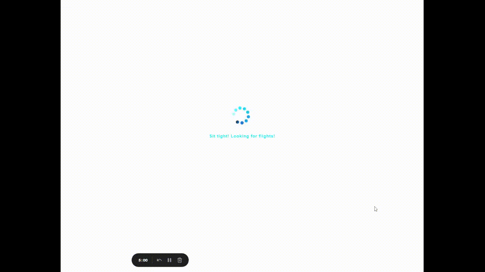

# U-GO

Through the platform, users buy airline tickets within their budget

# Goal
I don't aim to create a real platform here, I just chose an idea to study more nestjs, mongodb and other tech.

Many aspects of this application are simple and the idea was just to create a proof of concept without adding too much complexity.

# Use cases and feature:

- Autentication, using jwt and encrpiting the user password;
- Login logout;
- Authorization;
- Creating a new account;
- Searching for flights;
- Seeing the results;
- Book a fligt.

# Stack:

- Monorepo via NX.
- Angular, frontend
- NestJs (NodeJs), backend.
- Mongo db, database.

- Cloud: AWS S3 for the front and EC2 for the back.
## Install

Install the dependecies using npm or yarn:

```bash
  cd U-GO
  npm install  or yarn install
```
    
## Running locally

Clone the project, EEnter the project directory

```bash
   U-GO cd
```

install the dependencies

```bash
   npm install or yarn install
```

Starting the server

```bash
   nx serve backend
```

Starting the frontend

```bash
   nx serve frontend
```

## Demonstration
 

